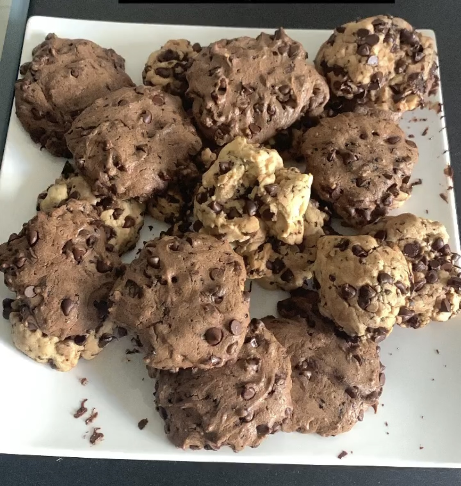

# Cookies de Neiman Marcus

## Ingrédients 
### *Pour 20 cookies*
* 250g de **chocolat** (noir, lait, blanc ou un mélange)
* 115g de **beurre demi-sel mou**
* 180g de **sucre roux**
* 35g de **sucre**
* 1 **oeuf**
* 220g de **farine**
* 2 cuillères à **café de levure chimique**
* 1 1/2 cuillère à **café de café soluble**

## Préparation 
1. Préchauffer le four à 150°C.
2. Concasser le chocolat au couteau pour obtenir des pépites.
3. Mélanger le beurre et les sucres, jusqu'à obtenir une consistance crémeuse. Ajouter l'oeuf et remuer.
4. Incorporer la farine et la levure puis mélanger jusqu'à obtenir une pâte souple. Ajouter le café et le chocolat et mélanger.
5. Avec un grande cuillère, déposer des petits tas de pâte sur la plaque en les espaçant bien et sans les aplatir
6. Enfourner pour 17 minutes. Les cookies doivent être juste blond et encore trés souples.
7. Laissez-les tiédir 2 minutes, retirez les de la plaque à l'aide d'une spatule puis laisser refroidir. Faire cuie le restant de la plaque de la même manière.

________________________________
#### Pour plus d'autres recettes: 
* [*Cookies aux pépites de chocolat 🍪*](Cookies aux pépites de chocolat.md)
* [*Kouign-Amann 🧈*](Kouign-Amann.md)
* [*Tarte à la rhubarbe 🥧*](Tarte à la rhubarbe.md)
* [*Brownie 🍫*](Brownies.md)

[Home Page](index.md)
