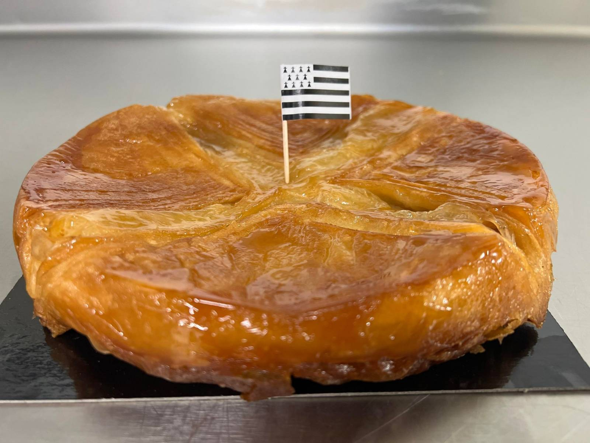

# Le Kouign-Amann
[🇬🇧](Kouign-Amann Eng.md)

## Ingrédients
### *Pour 6 personnes* 
* 15g de **levure de boulanger**
* 20cl **d'eau tiède**
* 200g de **beurre demi sel mou**
* 300g de **farine**
* 10g de **beurre fondu**
* 200g de **sucre en poudre**

## Préparation 
1. Délayez la levure dans 20cl d'eau tiède. Laissez ramollir le beurre à température ambiante.
2. Tamiser la farine en fontaine dans un saladier, mettez la levure délayée et le beurre fondu au centre, puis pétrissez pendant une dizaine de minutes, jusqu'à ce que la pâte soit souple et homogène. Recouvrez-la d'un linge et laissez la doubler de volume 1 heure environ dans un endroit tiède.
3. Abaisser la pâte au rouleau pour former une grande crêpe. Étalez le beurre ramolli dessus, en laissant une marge de 2 cm sur le pourtour, et versez le sucre en poudre pour recouvrir le beurre. Repliez cette crêpe de manière qu'elle forme un triangle.
4. Préchauffez le four à 200 "C (therm. 6-7).
5. Laissez reposer la pâte quelques minutes, puis étalez-la de nouveau au rouleau. Repliez-la en quatre et étalez-la de nouveau en forme de long rectangle. Enroulez la pâte sur elle-même comme un escargot, puis aplatissez là à la main en lui donnant une forme circulaire d'environ 22 cm de diamètre.
6. Badigeonnez généreusement un moule à manqué de beurre, puis saupoudrez le de sucre en poudre. Tapez sur le moule en le tournant pour bien le répartir.
7. Déposez la pâte dans le moule.
8. Enfournez et laissez cuire pendant 30 minutes en couvrant le gâteau avec une feuille d'aluminium en fin de cuisson si la surface brunit trop vite.
9. Démoulez-le chaud et servez le tiède.

________________________________
#### Pour plus d'autres recettes:
* [*Cookies aux pépites de chocolat 🍪*](Cookies aux pépites de chocolat.md)
* [*Cookies de Neiman Marcus 🍪*](Cookies de Neiman Marcus.md)
* [*Tarte à la rhubarbe 🥧*](Tarte à la rhubarbe.md)
* [*Brownie 🍫*](Brownies.md)

[Page d'accueil](index.md)
