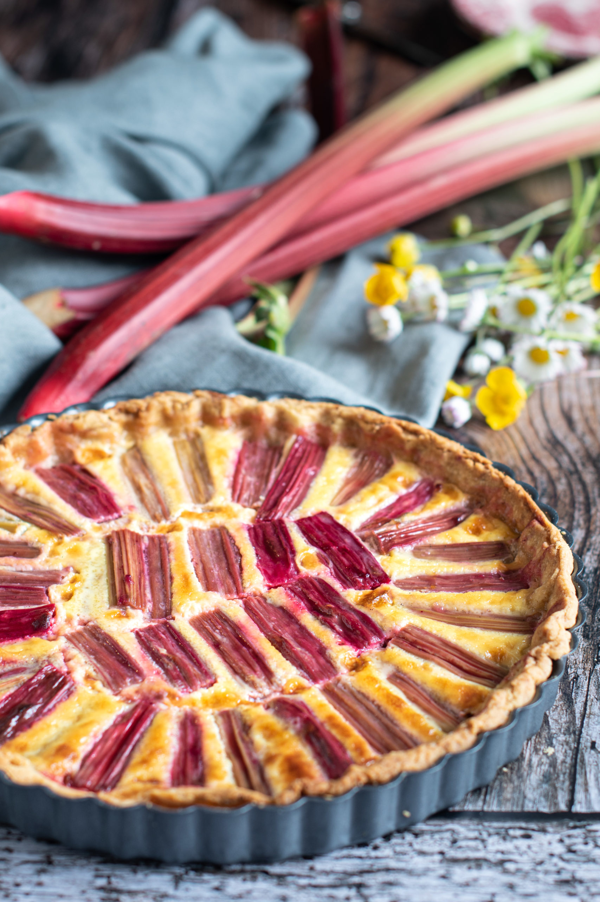

# Rhubarb pie
[🇫🇷](Tarte à la rhubarbe.md)

## Ingredients
### *Pour 6 people* 
* 5 branches of **rhubarb**
* 200g **flour**
* 8 tablespoons **sugar**
* 6 knobs of **butter**
* 2 tablespoons **oil**
* 1 small pot of **crème fraiche**
* 2 **eggs**
* and **water**
  
## Preparation 
1. Turn the oven on to 200°C (th. 6) Wash the rhubarb, remove the two ends of each branch and cut into pieces about 1cm long. 
2. Melt the butter with two tablespoons of water. Mix the butter, flour, oil, half the sugar and a little water to make the dough.
3. Dust the table with flour and roll out the dough. Place in a pie dish on baking paper and poke with a fork.
4. Place the rhubarb on top. Mix the eggs, cream and remaining sugar and pour over the rhubarb. Bake the tart for 35 minutes.  

________________________________
#### For more recipes: 
* [*Chocolate Chips Cookies 🍪*](Chocolate Chips Cookies.md)
* [*Neiman Marcus' Cookies 🍪*](Neiman Marcus' Cookies.md)
* [*Kouign-Amann 🧈*](Kouign-Amann Eng.md)
* [*Brownie 🍫*](Brownies Eng.md)

[Home Page](Indexeng.md)
